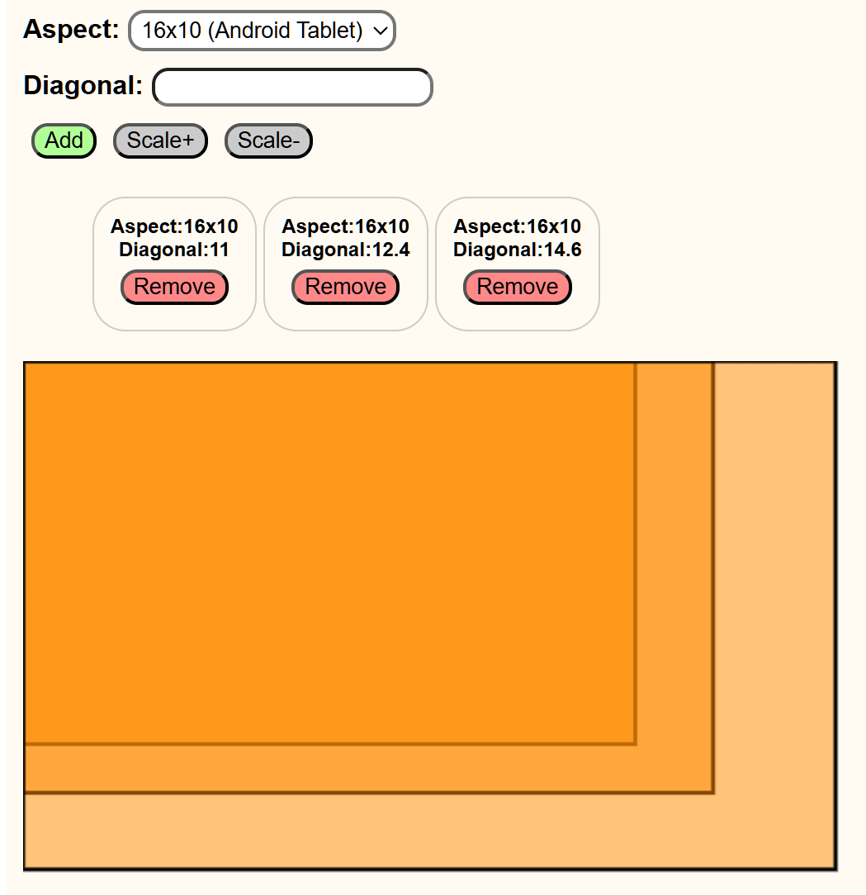
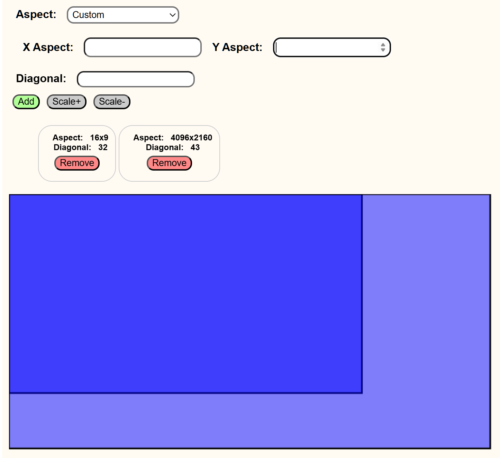

# Multi-Display-Compare

React application for visualizing and comparing various screen sizes based on the aspect ratios and diagonal sizes.

Purpose:

-> Helps you to choose the perfect TV or laptop or Tablet size by visually comparing different screen sizes and their aspect ratios

-> Avoiding marketing gimmicks of Screen Sizes(especially phones) Ex: a 6.9"(21x9) phone has ~same width(compactness) as a 6.5"(19.5x9) phone

Features:

-> Customizable dropdown menus with various aspect ratio options (standard, wide, cinematic, etc.) for precise comparison, Custom option to choose custom X and Y aspects.

-> Easily scale and adjust the size of each display to simulate different screen dimensions.

-> Dynamic color schemes for comparison everytime you refresh

Used Technologies: HTML canvas, React Hooks(useState, useRef, useEffect, useMemo)

Comparison of Tab S9 series screen sizes: 

Comparison b/w 32" and 43" TVs

